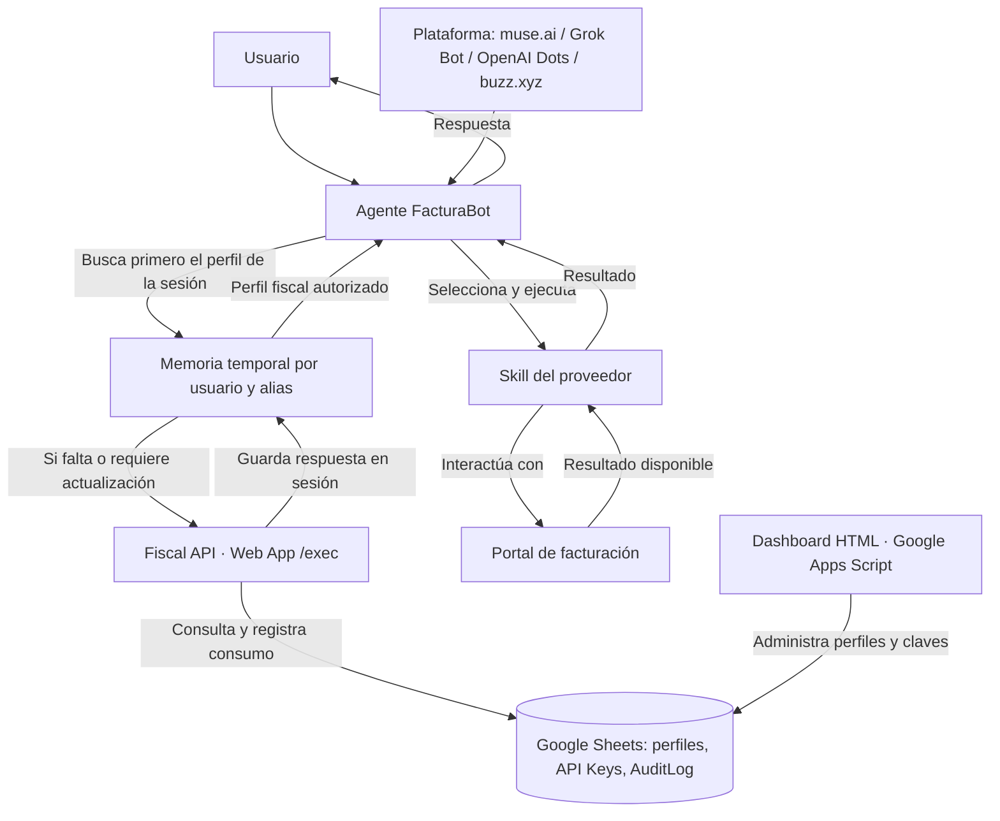

# FacturaBot


**Agente de IA para automatizar la facturación con distintos proveedores en México**

Diseñado para operar 24/7 en la nube · Perfiles fiscales bajo control de cada usuario


## Resumen

FacturaBot recibe una solicitud de facturación, identifica al proveedor, consulta el perfil fiscal indicado por el usuario y ejecuta la skill correspondiente. Su arquitectura separa la conversación y la automatización del almacenamiento de datos fiscales: **cada usuario puede operar su propia Fiscal API**.

La Fiscal API utiliza **Google Sheets (Google Spreadsheets)** como base de datos y **Google Apps Script (Google Scripts)** como backend. Incluye un dashboard HTML para administrar perfiles y API Keys, y publica una Web App con un endpoint `/exec` para las consultas del agente. La versión actual de este componente es **1.0.0**.

La guía principal de agente está en [`agent/muse-ai/`](agent/muse-ai/). Las carpetas de Grok Bot, OpenAI Dots y buzz.xyz son esqueletos de referencia: todavía no tienen instrucciones de instalación completas ni están verificadas para otra cuenta. Las skills incluidas son Walmart, Farmacias Guadalajara y La Gran Bodega; cada una debe configurarse con los datos y credenciales del usuario antes de operar.

### Arquitectura



El agente coordina el flujo; la Fiscal API es la fuente de verdad; cada skill contiene la lógica de un proveedor. El agente reutiliza el perfil desde la memoria temporal de la sesión y evita consultar Google Sheets por cada factura. Consulta [la arquitectura detallada](docs/ARCHITECTURE.md) y [el contrato de la API](shared/api-contract.md).

## Características principales

- **Perfiles fiscales por alias.** El agente consulta Fiscal API cuando el perfil falta o debe actualizarse y lo reutiliza durante la sesión, sin escribirlo en la skill.
- **API Keys administrables.** El dashboard permite generar claves con vigencia de 1, 30 o 90 días, recuperarlas y revocarlas.
- **Registro de consumo.** Las consultas externas quedan registradas en `AuditLog`.
- **Skills independientes.** Cada proveedor tiene su propio flujo. `skills/_template/` sirve como punto de partida para nuevas integraciones.
- **Configuración por plataforma.** Los archivos de `agent/` mantienen separados los prompts, la instalación y los secretos de cada plataforma.
- **Tecnologías accesibles.** La Fiscal API se apoya en una hoja de cálculo de Google, archivos `.gs` de Apps Script y un dashboard en HTML/CSS/JavaScript; la documentación y las skills están en Markdown.

### Estructura del repositorio

```text
FacturaBot/
├── agent/                 # Configuración por plataforma
│   ├── muse-ai/
│   ├── grok-bot/
│   ├── openai-dots/
│   └── buzz-xyz/
├── fiscal-api/
│   ├── apps-script/       # Backend, endpoint y dashboard
│   └── spreadsheet/       # Plantilla de Google Sheets en formato .xlsx
├── skills/
│   ├── _template/         # Base para proveedores nuevos
│   ├── walmart/          # Walmart y formatos documentados en esa skill
│   ├── farmacia-guadalajara/
│   └── gran-bodega/
├── shared/                # Contrato y convenciones compartidas
├── docs/                  # Contexto, arquitectura y roadmap
└── releases/              # Notas de versión
```

## Requerimientos de sistema

| Requisito | Para qué se necesita |
| --- | --- |
| Cuenta de Google con acceso a Google Drive, Google Sheets y Google Apps Script | Guardar la plantilla, crear y administrar una copia propia de la Fiscal API. |
| Navegador y conexión a Internet | Configurar la hoja, publicar la Web App y usar los portales de facturación. |
| Una plataforma de agente compatible con la instalación prevista | Ejecutar FacturaBot y cargar las skills necesarias. |
| Bóveda o gestor de secretos de esa plataforma | Guardar la API Key fuera del código y de los archivos versionados. |
| Comprobantes y datos de compra del proveedor | Proporcionar las entradas que requiera cada skill. |

La Fiscal API usa el entorno alojado de Google Apps Script; **no exige un servidor local ni Node.js**. Las skills que incluyan scripts auxiliares necesitan Python 3 disponible en la plataforma del agente. La disponibilidad continua depende de la plataforma elegida.

## Configuración

### 1. Preparar la Fiscal API

Sigue la [guía de instalación de Google Sheets y Apps Script](fiscal-api/apps-script/README.md). Incluye la importación de la plantilla, copia de los archivos, autorización, inicialización, prueba y publicación de la Web App.

Cada usuario debe crear su propia hoja e implementación. La plantilla del repositorio no debe contener datos fiscales reales. El código fuente de la API y una lista de sus archivos están en [fiscal-api/apps-script/README.md](fiscal-api/apps-script/README.md).

### 2. Configurar el agente

1. Elige la carpeta de tu plataforma: [muse.ai](agent/muse-ai/), [Grok Bot](agent/grok-bot/), [OpenAI Dots](agent/openai-dots/) o [buzz.xyz](agent/buzz-xyz/).
2. Usa el `system-prompt.md` de esa carpeta como base y carga las skills de los proveedores que vayas a utilizar.
3. Configura en el agente la URL `/exec` de tu Fiscal API y guarda la API Key en la bóveda de la plataforma. `YOUR_ENDPOINT` y `YOUR_API_KEY` son los placeholders usados en los ejemplos; no pegues la clave en prompts, skills ni archivos del repositorio.
4. Sigue la [guía de Muse](agent/muse-ai/setup.md). Comprueba que la skill elegida recibe los datos del ticket por OCR y que el agente reutiliza el perfil fiscal en la sesión. Las otras carpetas de plataforma todavía no están listas para instalación.

La consulta de perfiles sigue este contrato; los valores de ejemplo son **placeholders**:

```http
POST YOUR_ENDPOINT
Content-Type: application/json
```

```json
{
  "action": "getFiscalProfile",
  "alias": "YOUR_ALIAS",
  "apiKey": "YOUR_API_KEY"
}
```

Una respuesta correcta tiene `ok: true` e incluye los datos fiscales en `data`. Si la API devuelve un error, el agente no debe inventar ni reutilizar datos de otro perfil. Los campos y códigos de error están documentados en [`shared/`](shared/).

### 3. Agregar proveedores

Para integrar un proveedor nuevo, parte de [`skills/_template/`](skills/_template/). La skill debe documentar el OCR del ticket, el mapeo a los campos del portal y la reutilización del perfil durante la sesión. No incluyas endpoints de API personales ni datos fiscales. Consulta [las reglas de skills](skills/README.md).

---

**Fiscal API v1.0.0** · Creada por [Nikko Tesla](https://nikkotesla.github.io/)
