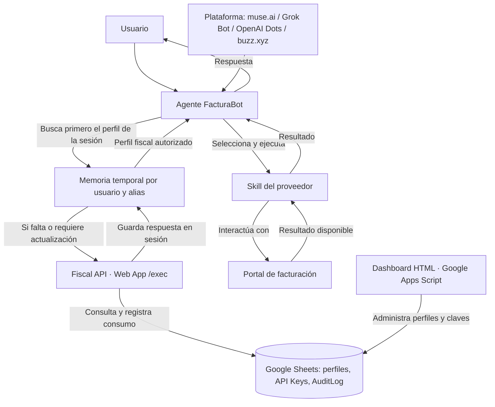

# FacturaBot


**Agente de IA para automatizar la facturación con distintos proveedores en México**

Diseñado para operar 24/7 en la nube · Perfiles fiscales bajo control de cada usuario

[](https://sheets.google.com/) [](https://script.google.com/) [](https://developer.mozilla.org/docs/Web/HTML) [](https://developer.mozilla.org/docs/Web/CSS) [](https://developer.mozilla.org/docs/Web/JavaScript) [](https://www.markdownguide.org/)

## Resumen

Cuando recibe una solicitud de factura, FacturaBot identifica al proveedor y comprueba si el repositorio incluye una skill para ese portal. **Si encuentra la skill correspondiente, sigue el flujo específico documentado allí para generar la factura. Si no existe, informa al usuario que ese proveedor aún no está soportado.** FacturaBot no automatiza automáticamente cualquier portal web: aunque un proveedor tenga un portal web de facturación, hace falta crear y validar una skill específica que describa sus pantallas, validaciones y pasos.

La Fiscal API utiliza **Google Sheets** para administrar los datos fiscales y **Google Apps Script** como backend. Google Sheets está ampliamente disponible para personas con una cuenta de Google y ofrece una forma sencilla de gestionar estos datos sin montar un servidor, incluso para usuarios sin experiencia técnica. Cada usuario configura su propia hoja y despliegue; el agente consulta el perfil fiscal autorizado y reutiliza ese perfil durante la sesión.

La guía principal para configurar el agente está en [`agent/muse-ai/`](agent/muse-ai/). Las carpetas de Grok Bot, OpenAI Dots y buzz.xyz son esqueletos de referencia: todavía no tienen instrucciones de instalación completas ni están verificadas para otra cuenta.

### Arquitectura



El agente coordina el flujo; la Fiscal API es la fuente de verdad; cada skill contiene la lógica de un proveedor. El agente reutiliza el perfil desde la memoria temporal de la sesión y evita consultar Google Sheets por cada factura. Consulta [la arquitectura detallada](docs/ARCHITECTURE.md) y [el contrato de la API](shared/api-contract.md).

## Características principales

- **Perfiles fiscales por alias.** El agente consulta Fiscal API cuando el perfil falta o debe actualizarse y lo reutiliza durante la sesión, sin escribirlo en la skill.
- **API Keys administrables.** El dashboard permite generar claves con vigencia de 1, 30 o 90 días, recuperarlas y revocarlas.
- **Registro de consumo.** Las consultas externas quedan registradas en `AuditLog`.
- **Soporte por proveedor mediante skills.** FacturaBot busca en [`skills/`](skills/) la skill del proveedor solicitado. Cada skill define el flujo de su portal. Si no encuentra una, informa que el proveedor aún no está soportado.
- **Contribuciones de la comunidad.** Si quieres añadir un proveedor, consulta la [guía para crear una skill](skills/_template/README.md), documenta y valida el flujo de su portal, y contribuye la nueva carpeta `skills/nombre-del-proveedor/` a este repositorio. Así otros usuarios también podrán utilizar esa integración.
- **Configuración por plataforma.** Los archivos de `agent/` mantienen separados los prompts, la instalación y los secretos de cada plataforma.
- **Tecnologías accesibles.** La Fiscal API se apoya en una hoja de cálculo de Google, archivos `.gs` de Apps Script y un dashboard en HTML/CSS/JavaScript; la documentación y las skills están en Markdown.

### Estructura del repositorio

```text
FacturaBot/
├── agent/                 # Configuración por plataforma
│   ├── muse-ai/
│   ├── grok-bot/
│   ├── openai-dots/
│   └── buzz-xyz/
├── fiscal-api/
│   ├── apps-script/       # Backend, endpoint y dashboard
│   └── spreadsheet/       # Plantilla de Google Sheets en formato .xlsx
├── skills/
│   ├── _template/         # Base para proveedores nuevos
│   ├── nombre-del-proveedor/ # Una carpeta por portal de facturación configurado
│   └── ...
├── shared/                # Contrato y convenciones compartidas
├── docs/                  # Contexto, arquitectura y roadmap
└── releases/              # Notas de versión
```

## Requerimientos de sistema

| Requisito | Para qué se necesita |
| --- | --- |
| Cuenta de Google con acceso a Google Drive, Google Sheets y Google Apps Script | Guardar la plantilla, crear y administrar una copia propia de la Fiscal API. |
| Navegador y conexión a Internet | Configurar la hoja, publicar la Web App y usar los portales de facturación. |
| Una plataforma de agente compatible con la instalación prevista | Ejecutar FacturaBot y cargar las skills necesarias. |
| Bóveda o gestor de secretos de esa plataforma | Guardar la API Key fuera del código y de los archivos versionados. |
| Comprobantes y datos de compra del proveedor | Proporcionar las entradas que requiera cada skill. |

La Fiscal API usa el entorno alojado de Google Apps Script; **no exige un servidor local ni Node.js**. Las skills que incluyan scripts auxiliares necesitan Python 3 disponible en la plataforma del agente. La disponibilidad continua depende de la plataforma elegida.

## Configuración

### 1. Preparar la Fiscal API

Sigue la [guía de instalación de Google Sheets y Apps Script](fiscal-api/apps-script/README.md). Incluye la importación de la plantilla, copia de los archivos, autorización, inicialización, prueba y publicación de la Web App.

Cada usuario debe crear su propia hoja e implementación. La plantilla del repositorio no debe contener datos fiscales reales. El código fuente de la API y una lista de sus archivos están en [fiscal-api/apps-script/README.md](fiscal-api/apps-script/README.md).

### 2. Configurar el agente

1. Elige la carpeta de tu plataforma: [muse.ai](agent/muse-ai/), [Grok Bot](agent/grok-bot/), [OpenAI Dots](agent/openai-dots/) o [buzz.xyz](agent/buzz-xyz/).
2. Usa el `system-prompt.md` de esa carpeta como base y carga las skills de los proveedores que vayas a utilizar.
3. Configura en el agente la URL `/exec` de tu Fiscal API y guarda la API Key en la bóveda de la plataforma. `YOUR_ENDPOINT` y `YOUR_API_KEY` son los placeholders usados en los ejemplos; no pegues la clave en prompts, skills ni archivos del repositorio.
4. Sigue la [guía de Muse](agent/muse-ai/setup.md). Comprueba que la skill elegida recibe los datos del ticket por OCR y que el agente reutiliza el perfil fiscal en la sesión. Las otras carpetas de plataforma todavía no están listas para instalación.

La consulta de perfiles sigue este contrato; los valores de ejemplo son **placeholders**:

```http
POST YOUR_ENDPOINT
Content-Type: application/json
```

```json
{
  "action": "getFiscalProfile",
  "alias": "YOUR_ALIAS",
  "apiKey": "YOUR_API_KEY"
}
```

Una respuesta correcta tiene `ok: true` e incluye los datos fiscales en `data`. Si la API devuelve un error, el agente no debe inventar ni reutilizar datos de otro perfil. Los campos y códigos de error están documentados en [`shared/`](shared/).

### 3. Agregar proveedores

FacturaBot solo genera facturas para proveedores que tengan una skill compatible en [`skills/`](skills/). Revisa esa carpeta para conocer los portales configurados. Si no encuentras la skill que necesitas, el bot te indicará que aún no soporta ese proveedor.

Para contribuir una integración, sigue la [guía para crear una skill](skills/_template/README.md) y las [reglas del catálogo](skills/README.md). Cada skill debe explicar cómo extraer por OCR los datos del ticket, mapearlos a los campos del portal y completar el flujo particular de ese proveedor. Después, agrega la nueva carpeta a este repositorio para que la comunidad pueda usarla. No incluyas endpoints personales, credenciales ni datos fiscales.

---

**Fiscal API v1.0.0** · Creada por [Nikko Tesla](https://nikkotesla.github.io/)
